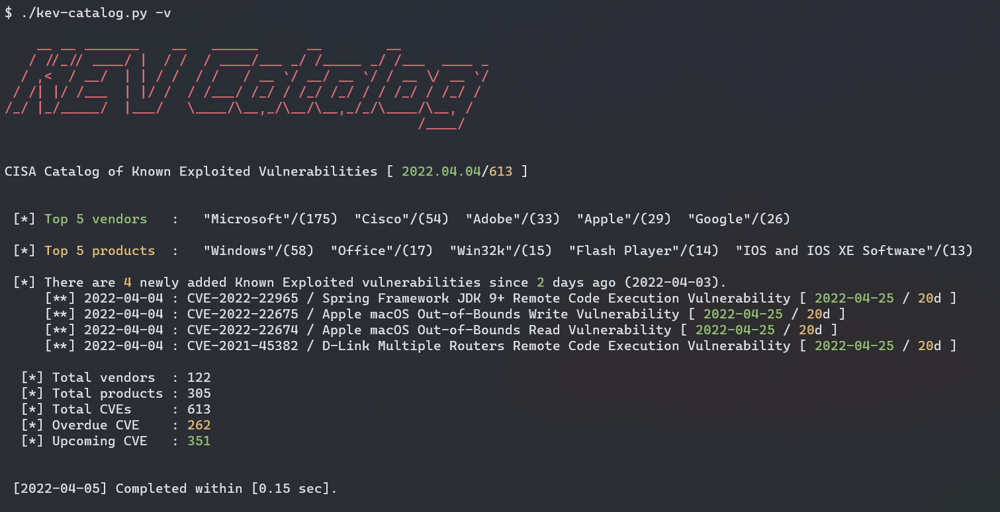
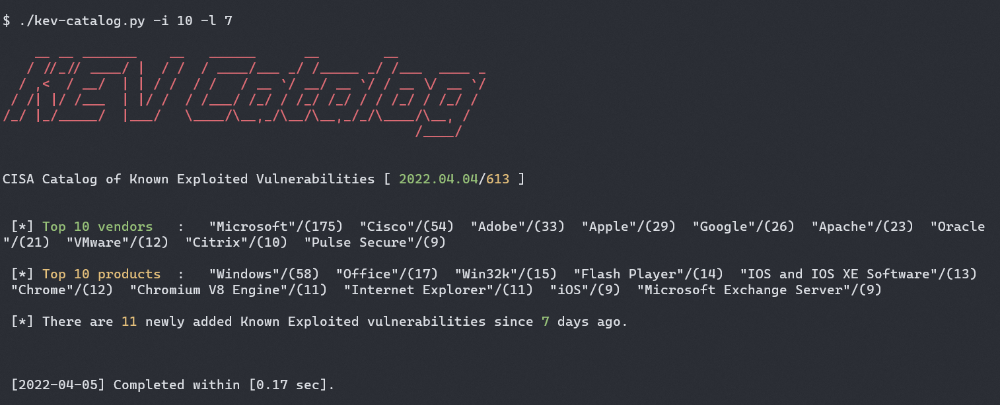
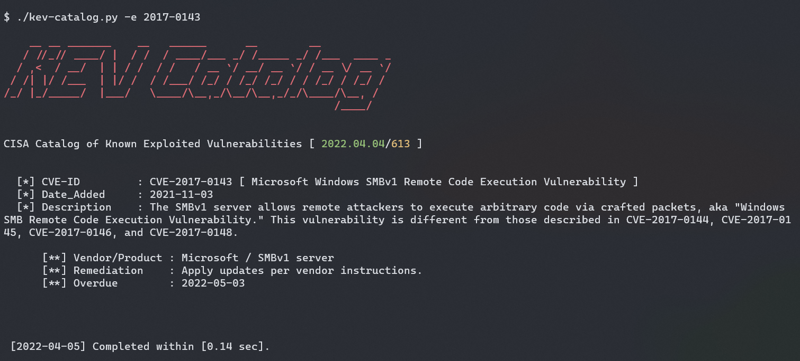
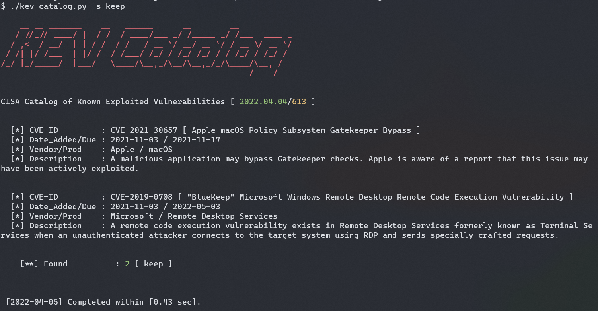

# kev-catalog.py
A simple tool to query CISA's KEV catalog. This tool is written in Python to shows the top-N vendors and the top-N vulnerable products found in the CISA's KEV. It also can search a specific CVE or keyword in the KEV json file. 

You also can save the JSON file from CISA website, and perform local search with this tool.

## Setup
```
$ pip3 install -r requirements.txt
```


## Usages
Run kev-catalog and show the verbose information.
```
$ ./kev-catalog.py -h
$ ./kev-catalog.py -v 
```



Run kev-catalog and show the top 10 vendors and top 10 vulnerable products.
```
$ ./kev-catalog.py -i 10
```



Run kev-catalog and show the last 8 days (inclusive) CVE.
```
$ ./kev-catalog.py -l 8 
```


Run kev-catalog and search for a specific CVE (2017-0143 for wannacry)
```
$ ./kev-catalog.py -e 2017-0143
```



Run kev-catalog and search for a specific keyword, like keep or bluekeep.
```
$ ./kev-catalog.py -s keep
```



Run kev-catalog and refer to a local JSON file.
```
$ ./kev-catalog.py -j known_exploited_vulnerabilities_20220401.json 
```

# References
- [CISA Known Exploited Vulnerabilities Catalog](https://www.cisa.gov/known-exploited-vulnerabilities-catalog)
- Download [JSON LINK](https://www.cisa.gov/sites/default/files/feeds/known_exploited_vulnerabilities.json)
- Download [CSV link](https://www.cisa.gov/sites/default/files/csv/known_exploited_vulnerabilities.csv)


# MySeq Blog
There is a hidden feature that cna show the Kenna query string. See in the blog post.
- https://myseq.blogspot.com/2022/04/publish-kev-catalog-on-github.html
- https://myseq.blogspot.com/2022/03/cisa-known-exploited-vuln-catalog.html

